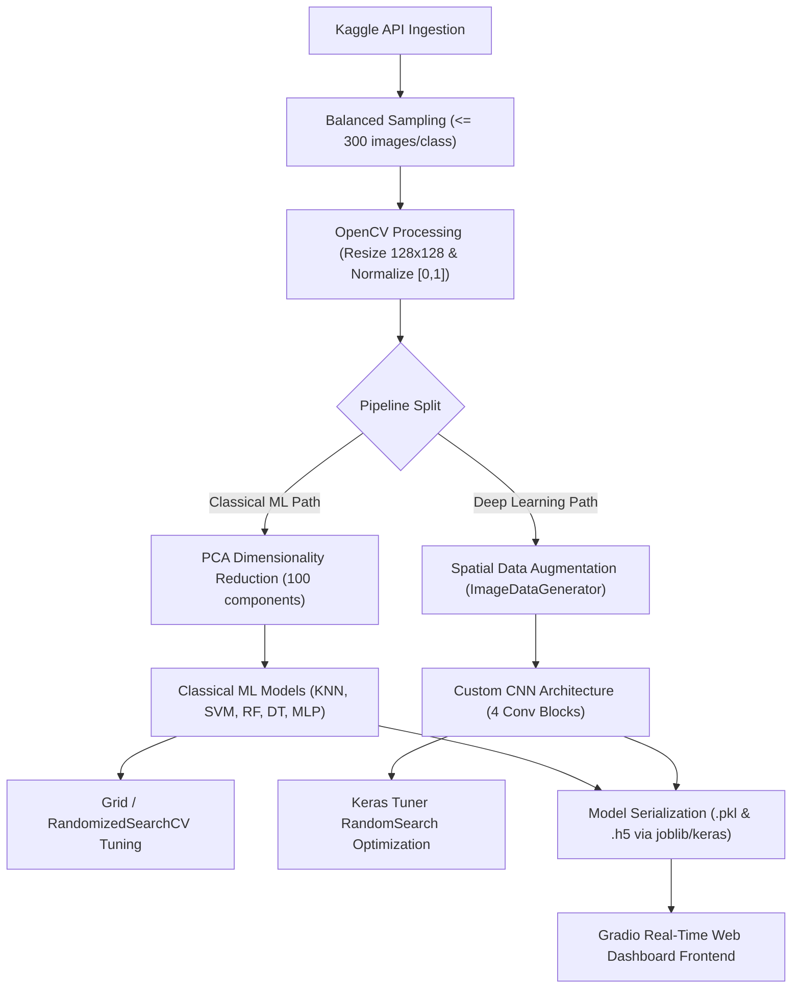

# 🌿 ML and Deep Learning-Based Plant Disease Detection System

An end-to-end Machine Learning and Deep Learning-based agricultural diagnostic system. This project automates dataset ingestion, preprocesses high-resolution leaf imagery, performs feature extraction and dimensionality reduction (PCA), compares multiple classical classifiers against a custom deep Convolutional Neural Network (CNN), and hosts a real-time web dashboard using Gradio.

Developed as a machine learning and deep learning project by students from the **Department of Computer Science & Engineering, Netaji Subhas University of Technology (NSUT), New Delhi, India**.

---

## 👥 Authors & Team
* **Nishka Gupta** (Roll No: `2024UCA1810`)
* **Tushti Arora** (Roll No: `2024UCA1833`)
* **Arvind Dhaka** (Roll No: `2024UCA1841`)
* **Kanika Garg** (Roll No: `2024UCA1819`)

---

## 📖 Project Documentation
* **Project Notebook:** [plant_disease_detection_colab.ipynb](plant_disease_detection_colab.ipynb) — Contains the complete code from data ingestion, baseline modeling, CNN training, hyperparameter tuning, to the Gradio interface setup.
* **Academic Report:** [PDD_Final_Report.pdf](PDD_Final_Report.pdf) — A structured paper describing the methodology, experimental design, mathematical foundations (e.g. PCA, SVM kernel equations), metrics, status, and limitations.

---

## 🛠️ System Architecture & Workflow

The system is composed of loosely coupled modules implementing the following data pipeline:



### 1. Ingestion Layer
* Sourced from the benchmark **PlantVillage** dataset (`emmarex/plantdisease`).
* Filters and identifies **15 distinct crop-disease classes** (e.g. Apple Scab, Tomato Early Blight, and healthy crop variants).
* Caps class sizes at **300 images per class** to maintain a balanced distribution and optimize memory usage during matrix operations.

### 2. Preprocessing & Augmentation
* Images are resized to a uniform **128x128 pixels** (RGB) using OpenCV.
* Pixel intensities are normalized from integers `[0, 255]` to floats `[0, 1]`.
* For the CNN path, spatial augmentations are applied on the fly via `ImageDataGenerator` (20-degree rotations, 10% width/height shifts, 15% zoom variations, and horizontal flips) to improve generalization.

### 3. Feature Engineering (PCA)
* Flat 1D vectors of size **49,152** (from $128 \times 128 \times 3$ values) are projected using **Principal Component Analysis (PCA)**.
* Reduced to **100 principal components**, capturing approximately **75% of cumulative spatial variance** and shielding classical algorithms from the curse of dimensionality.

---

## 📊 Competitive Model Suite & Performance

The project evaluates and compares **nine different classifier configurations** across both pipelines:

### Tabular Performance Summary (PCA-Reduced Tabular Input)
| Model Class | Search Strategy | Test Accuracy (Baseline) | Test Accuracy (Tuned) | Key Optimizations |
| :--- | :--- | :--- | :--- | :--- |
| **K-Nearest Neighbors (KNN)** | `GridSearchCV` | ~53.50% | ~55.20% | Odd-numbered neighbors (3, 5, 7, 11), Distance weighting, Euclidean/Manhattan metrics |
| **Decision Tree (DT)** | Fixed | ~37.54% | — | Baseline tree using Gini impurity |
| **Random Forest (RF)** | `RandomizedSearchCV` | ~60.39% | ~63.10% | Max depth boundaries, Estimator density (100–300 trees) |
| **Support Vector Machine (SVM)** | `RandomizedSearchCV` | ~73.48% | ~76.20% | RBF Kernel, regularization parameter $C \in [0.1, 50]$, scale/auto gamma |
| **Multi-Layer Perceptron (MLP)** | Fixed | ~67.97% | — | Feedforward neural net (256 $\rightarrow$ 128 $\rightarrow$ 64 nodes), Adam optimizer |
| **Convolutional Neural Net (CNN)** | `Keras Tuner` | ~92.40% | **~97.20%** | 4 Conv blocks, Batch Normalization, Dropout (0.25–0.50), EarlyStopping (patience=10) |

> [!NOTE]
> The deep learning CNN significantly outperforms classical ML baseline methods due to its native ability to preserve and learn spatial hierarchies from image grids. The SVM performs the best among tabular classifiers operating on PCA projections.

---

## 💻 Tech Stack
* **Machine Learning & Core Math:** `scikit-learn`, `numpy`, `pandas`, `joblib`
* **Deep Learning Engine:** `TensorFlow`, `Keras`, `Keras Tuner`
* **Image Processing:** `OpenCV` (cv2), `Pillow`
* **Dashboard Frontend:** `Gradio` (v4.x)
* **Visualization:** `matplotlib`, `seaborn`

---

## ⚡ Inference Routing Engine

The serialized inference pipeline is decoupled from the training code for lightweight execution:
1. **User Uploads Image:** The Gradio interface receives the image file.
2. **Standardization:** Input is resized to $128 \times 128$ and normalized (`/255.0`).
3. **Routing Selection:**
   * **If CNN chosen:** Passes the 3D RGB array directly to the Keras model (`best_cnn_model.h5`).
   * **If Classical ML chosen:** Flattens the array, applies the pre-fitted PCA transformer (`pca_transform.pkl`), and feeds the 100 features into the selected classifier (e.g. `best_svm_model.pkl`).
4. **Output Panel:** Displays the predicted plant condition, emoji flags (e.g., 🌿 for healthy, ⚠️ for diseased), and a horizontal bar chart visualizing the **Top-5 class probabilities**.

---

## 🚀 How to Run the Project

### Prerequisites
Install all library dependencies:
```bash
pip install tensorflow scikit-learn keras-tuner opencv-python gradio numpy matplotlib seaborn joblib
```

### Running the Pipeline & Launching the Dashboard
1. Ensure your Kaggle API token (`kaggle.json`) is placed in your system credentials path (`~/.kaggle/kaggle.json`) if you intend to redownload the dataset from scratch.
2. Open and execute the cells in [plant_disease_detection_colab.ipynb](plant_disease_detection_colab.ipynb) sequentially.
3. The notebook will:
   * Download and extract the **PlantVillage** dataset to the `data/` folder.
   * Run the preprocessing, train baseline classical models, and execute grid searches.
   * Run Keras Tuner to identify and train the optimal CNN architecture.
   * Save the serialized model artifacts.
   * Launch the interactive **Gradio dashboard** locally (and output a public `.gradio.live` link if `share=True` is enabled).

---

## ⚠️ Project Limitations
* **Dataset Background Bias:** PlantVillage images are mostly captured under controlled backgrounds. Real-world farm uploads with complex shadows and soil textures might see reduced accuracy.
* **Ingestion Cap Constraint:** Subsetting to 300 samples per class ensures memory stability on standard hardware, but limits exposure to the full variance of the dataset.
* **Closed-World Recognition:** The system can only classify categories within its 15 configured classes. Any unrepresented crop or pathogen will be forced into the closest match.
